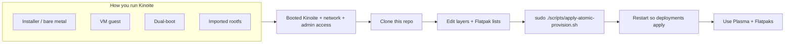
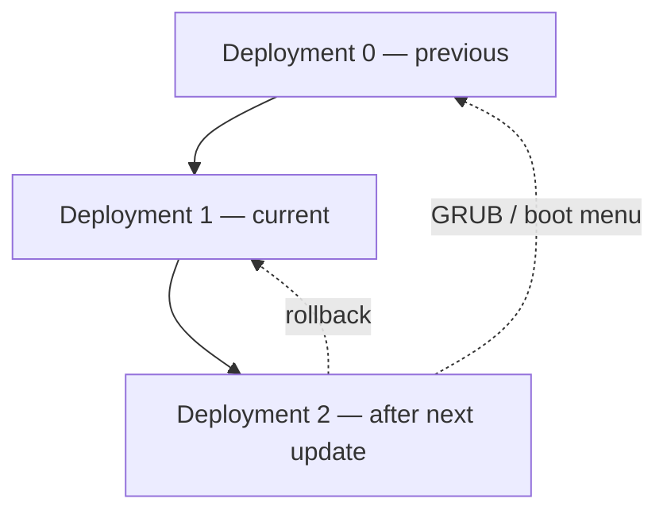

# Getting started

This is a **single path** through this repository: you run **Fedora Kinoite** somewhere, then use the same declarative lists and the same apply script. Installation medium (installer ISO, VM, dual-boot, imported rootfs, etc.) only changes a **few** concrete actions — those appear in **`CAUTION`** at the end of a step, not in the main instructions.

**Useful background from Fedora and upstream** (open in a browser if anything here is new):

- [Fedora Kinoite — Atomic Desktops overview](https://fedoraproject.org/atomic-desktops/kinoite/) — what Kinoite is and why Flatpak + `rpm-ostree`.
- [Download Fedora Kinoite](https://fedoraproject.org/atomic-desktops/kinoite/download/) — ISO and image hints.
- [Fedora Kinoite documentation](https://docs.fedoraproject.org/en-US/fedora-kinoite/) — installation, post-install, desktop topics, **Toolbx**, updates, and atomic-desktop workflows.
- [`rpm-ostree` documentation](https://coreos.github.io/rpm-ostree/) — how atomic updates and package layering work.
- [Flatpak — Fedora setup](https://flatpak.org/setup/Fedora/) — enabling Flatpak on Fedora.
- [Flathub](https://flathub.org/) — application catalog and remote URL users expect.

---

## What you are building toward

Kinoite ships **KDE Plasma** and expects most desktop apps as **Flatpaks**. The OS image itself is updated atomically; extra RPMs are **layered** with `rpm-ostree` when you need them.


*Source: [Wikimedia Commons — XWayland KDE Plasma screenshot](https://commons.wikimedia.org/wiki/File:XWayland_KDE_Plasma_screenshot.png) (Mozilla Public License 2.0; KDE / screenshot composite).*

---

## All paths converge here

Whatever you did to **get** Kinoite, the **maintenance path in this repo** is the same:



Differences are **only** in how you complete **first boot**, **users**, **restarts**, and sometimes **GUI** — spelled out in **`CAUTION`** where it matters.

---

## Step 1 — Finish installing Kinoite until you can log in and open a terminal

1. Complete your install using the **official** Kinoite images and guides linked in the introduction (partitioning, user creation, and first login are part of that process, not this repo).
2. Boot into Kinoite, log in to a desktop session (or a text console with network), and confirm you can run a terminal with **`sudo`** when needed.

> **CAUTION — imported rootfs (common when Linux was created from a container export)**  
> You may have **no normal user** yet or **no graphical login** as you would on a metal install. Fix **user**, **`/etc/wsl.conf`**, **systemd**, and **WSLg** using the **single** WSL-focused doc: [config/wsl2/README.md](config/wsl2/README.md), with more narrative in [docs/kinoite-wsl2.md](docs/kinoite-wsl2.md). Until that is sorted, treat this step as **not done**.

> **CAUTION — VM guest**  
> “Reboot” later in this guide means **reboot the machine that is running Kinoite** (the **guest**), not necessarily the physical host.

---

## Step 2 — Clone this repository on the Kinoite system

1. Install **`git`** if it is not present (on atomic desktops you often layer it with `rpm-ostree install git` once, or use a **toolbox** container — see [Toolbx in the Kinoite docs](https://docs.fedoraproject.org/en-US/fedora-kinoite/toolbox/)).
2. Clone wherever you keep workspaces, for example:

   ```bash
   git clone <URL-of-this-repository>
   cd Kinoite
   ```

> **CAUTION — Windows filesystem vs Linux filesystem**  
> If the clone lives under **`/mnt/...`** from a hybrid host, expect lower performance and permission quirks. Prefer the Linux-native filesystem (e.g. under your home directory on the Kinoite side) for daily work.

---

## Step 3 — Edit the declarative lists

The full rules and optional boot-time service are in [PROVISION](PROVISION). For conceptual background: [rpm-ostree: package layering](https://coreos.github.io/rpm-ostree/) and the [Fedora Kinoite documentation](https://docs.fedoraproject.org/en-US/fedora-kinoite/) linked above.

1. Open **`config/rpm-ostree/layers.list`** and **uncomment** (or add) RPM package names you want **layered** on the base image.
2. Open **`config/flatpak/*.list`** and add **Flatpak application IDs** (as used on Flathub).
3. **(Bare metal / VM with Wi‑Fi)** Copy [config/network/wifi.example.nmconnection](config/network/wifi.example.nmconnection) to a **gitignored** path such as `host-local/` (see [config/secrets/README.md](config/secrets/README.md)), set SSID/PSK only on the machine, then import with `nmcli` or place under `/etc/NetworkManager/system-connections/` (mode `0600`).
4. **(Optional)** Timezone and keyboard: copy [config/locale.env.example](config/locale.env.example) → `host-local/locale.env`, edit, then run `sudo ./scripts/provision-locale.sh` once.

---

## Step 4 — Apply provisioning

From the **repository root** on **Kinoite**:

```bash
sudo ./scripts/apply-atomic-provision.sh
```

- Re-run after you change the lists; the script is intended to be **idempotent**.
- **`sudo`** uses your login user for Flatpak installs when possible (see script header in [scripts/apply-atomic-provision.sh](scripts/apply-atomic-provision.sh)).

---

## Step 5 — Restart so `rpm-ostree` deployments can take effect

After **new** layered packages, `rpm-ostree` applies them on the **next boot** of the environment that runs Kinoite.

1. Save work and **restart** that environment the way you normally would for a full system update.

> **CAUTION — Linux running under Windows’ WSL2**  
> From **Windows**, run **`wsl --shutdown`** (or reboot Windows). That replaces a traditional “hardware” reboot for the WSL2 VM. Details: [config/wsl2/README.md](config/wsl2/README.md) and [PROVISION](PROVISION).

---

## Step 6 — Confirm Flatpak and Flathub

If **`apply-atomic-provision.sh`** already configured remotes and installed apps from your lists, **Discover** or **`flatpak list`** should show them.

Otherwise, align with upstream guidance:

- [Flatpak — Fedora](https://flatpak.org/setup/Fedora/)
- [Flathub quick setup — Fedora](https://flathub.org/setup/Fedora) (adds the Flathub remote users expect)

---

## Step 7 — (Optional) Apply only layered RPMs at boot

To stage **`rpm-ostree`** layers at boot **without** driving Flatpaks in that systemd path:

```bash
sudo ./scripts/install-atomic-provision-service.sh YOUR_LINUX_USER
```

See [PROVISION](PROVISION) and [config/systemd/kinoite-atomic-ostree.service](config/systemd/kinoite-atomic-ostree.service).

---

## Step 8 — Updates, status, and rollback (ongoing)

Use the same habits as any **atomic** Fedora desktop:

- Update the base: **`rpm-ostree update`** (or the graphical updater — see Fedora atomic-desktop docs).
- Inspect deployments: **`rpm-ostree status`**.
- If a boot breaks, boot the previous entry in the boot menu or use **`rpm-ostree rollback`** as documented in [rpm-ostree administration](https://coreos.github.io/rpm-ostree/) and the [Fedora Kinoite documentation](https://docs.fedoraproject.org/en-US/fedora-kinoite/) (updates / atomic upgrades sections).

The Kinoite docs (and other Fedora Atomic Desktop guides) illustrate **atomic updates** with diagrams; open [Fedora Kinoite documentation](https://docs.fedoraproject.org/en-US/fedora-kinoite/) in a browser if you want the official figures (some hosts use strict front-end checks for static assets). Roughly, the model looks like this:



For the official illustrated explanation, search the Kinoite docs for **atomic** / **rollback** / **updates**. Application installs: [Flathub](https://flathub.org/) and [Flatpak on Fedora](https://flatpak.org/setup/Fedora/).

---

## Where WSL2-only material lives

Everything **Windows-host**, **WSLg**, and **import-specific** is intentionally **not** duplicated here. Use **[config/wsl2/README.md](config/wsl2/README.md)** only when **`CAUTION`** in this guide points you there.

---

## Research note

Automated search via **Tavily** was unavailable (API quota) while this file was written; links were chosen from **Fedora**, **`rpm-ostree`**, **Flatpak**, **Flathub**, and **Wikimedia Commons** as stable, citable sources. Re-run your preferred research tool if you need version-specific release notes or a newer install walkthrough.
