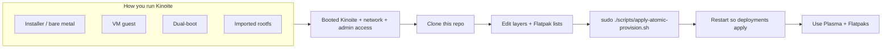
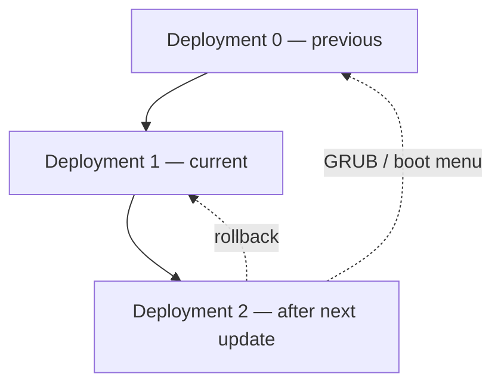

# Fedora Kinoite (WSL2) — workspace

**Phase A:** Kinoite / OSTree userland in **WSL2** with **systemd**, **`rpm-ostree`**, **Flatpak (Flathub)**, and **KDE Plasma** under **WSLg** — not classic Fedora (dnf) as a substitute.

**Workspace root:** your clone path on Windows. Set **`KINOITE_WORKSPACE_ROOT`** to that path so scripts and tools resolve the repo without hard-coding a drive (see [config/README.md — workspace + locale](config/README.md#workspace-root-and-locale-windows--agents)). Example: `KINOITE_WORKSPACE_ROOT=D:\repos\Kinoite`.

**Agents / automation:** start at [Getting started](#getting-started-full-install-path) (edit `config/rpm-ostree/layers.list` + `config/flatpak/kinoite.list`, then **`sudo ./scripts/apply-atomic-provision.sh`**). Do not commit raw `imports/` exports (see `.gitignore`).

## Where to start

| Step | Pointer |
|------|---------|
| Read the funnel | [Getting started](#getting-started-full-install-path) |
| WSL2 / import / Plasma | [docs/kinoite-wsl2.md](docs/kinoite-wsl2.md), [config/wsl2/README.md](config/wsl2/README.md) |
| Declarative packages | [config/rpm-ostree/layers.list](config/rpm-ostree/layers.list), [config/flatpak/](config/flatpak/) |
| Apply on the distro | [scripts/apply-atomic-provision.sh](scripts/apply-atomic-provision.sh) |
| Windows → Linux app notes | [docs/windows-migration.md](docs/windows-migration.md) |
| Optional Windows inventory | [scripts/README.md — imports](scripts/README.md#the-imports-directory) |
| VM / bare metal phases | [docs/kinoite-wsl2.md — migration](docs/kinoite-wsl2.md#migration-checklist-wsl-lab--bare-metal-kinoite) |
| Doc index | [Documentation hub](#topic-docs-and-provisioning-plane) (below) |

**Repo checks:** [scripts/check-md-links.ps1](scripts/check-md-links.ps1) (*Run Task* in [.vscode/tasks.json](.vscode/tasks.json)). **CI:** [.github/workflows/markdown-link-check.yml](.github/workflows/markdown-link-check.yml).

## Quick links

| Doc | Purpose |
|-----|---------|
| **[Documentation hub](#topic-docs-and-provisioning-plane)** | **Topic → provisioning** table (in this README) |
| [Getting started](#getting-started-full-install-path) | **Step-by-step** path (same section below); **[atomic provisioning](#step-3--edit-the-declarative-lists)** |
| [scripts/README.md](scripts/README.md) | **Script catalog** (import, apply, Windows inventory, WSL helpers) |
| [docs/kinoite-wsl2.md](docs/kinoite-wsl2.md) | **Authoritative** Phase A: import, WSL, Plasma, rollback |
| [config/wsl2/README.md](config/wsl2/README.md) | WSL2/WSLg templates (`/etc/wsl.conf`, WSLg env, `.wslconfig` excerpts) |
| [docs/windows-migration.md](docs/windows-migration.md) | **Win11 ↔ Kinoite** (`imports/`, TSV, linux-map) and **[appendix: Plasma, VPN, IDEs, LLM, homelab](docs/windows-migration.md#appendix-kde-desktop-networking-ides-and-homelab)** |

*Topic doc → `rpm-ostree` / Flatpak / `host-local`:* **[#topic-docs-and-provisioning-plane](#topic-docs-and-provisioning-plane)** (in this file).

## Scripts (order of operations)

1. **Windows (PowerShell, elevated if needed):** [scripts/import-kinoite-rootfs-to-wsl.ps1](scripts/import-kinoite-rootfs-to-wsl.ps1) — `podman pull` → `podman create` → `podman export`; optional **`-DoImport`** when **`KINOITE_WSL_INSTALL_DIR`** (or **`-InstallLocation`**) is set (defaults for tarball: **`KINOITE_WORKSPACE_ROOT`** + `scratch\` — see script header).
2. **Inside WSL distro:** [scripts/bootstrap-kinoite-wsl2.sh](scripts/bootstrap-kinoite-wsl2.sh) — Flathub hint + optional profile.d (`KINOITE_INSTALL_WSLG_PROFILE=1`), then [scripts/apply-atomic-provision.sh](scripts/apply-atomic-provision.sh). Optional boot-time layers only: **`sudo ./scripts/apply-atomic-provision.sh install-service`**.
3. **Inventory (Windows, optional):** [scripts/windows-inventory.ps1](scripts/windows-inventory.ps1) → `imports/` (mostly gitignored).

## Legal

Proprietary game assets and Windows-only installers are **your** responsibility; this tree is **documentation + scripts** only.

---

## Getting started (full install path)

This is a **single path** through this repository: you run **Fedora Kinoite** somewhere, then use the same declarative lists and the same apply script. Installation medium (installer ISO, VM, dual-boot, imported rootfs, etc.) only changes a **few** concrete actions — those appear in **`CAUTION`** at the end of a step, not in the main instructions.

**Useful background from Fedora and upstream** (open in a browser if anything here is new):

- [Fedora Kinoite — Atomic Desktops overview](https://fedoraproject.org/atomic-desktops/kinoite/) — what Kinoite is and why Flatpak + `rpm-ostree`.
- [Download Fedora Kinoite](https://fedoraproject.org/atomic-desktops/kinoite/download/) — ISO and image hints.
- [Fedora Kinoite documentation](https://docs.fedoraproject.org/en-US/fedora-kinoite/) — installation, post-install, desktop topics, **Toolbx**, updates, and atomic-desktop workflows.
- [`rpm-ostree` documentation](https://coreos.github.io/rpm-ostree/) — how atomic updates and package layering work.
- [Flatpak — Fedora setup](https://flatpak.org/setup/Fedora/) — enabling Flatpak on Fedora.
- [Flathub](https://flathub.org/) — application catalog and remote URL users expect.

---

## What you are building toward

Kinoite ships **KDE Plasma** and expects most desktop apps as **Flatpaks**. The OS image itself is updated atomically; extra RPMs are **layered** with `rpm-ostree` when you need them.


*Source: [Wikimedia Commons — XWayland KDE Plasma screenshot](https://commons.wikimedia.org/wiki/File:XWayland_KDE_Plasma_screenshot.png) (Mozilla Public License 2.0; KDE / screenshot composite).*

---

## All paths converge here

Whatever you did to **get** Kinoite, the **maintenance path in this repo** is the same:



Differences are **only** in how you complete **first boot**, **users**, **restarts**, and sometimes **GUI** — spelled out in **`CAUTION`** where it matters.

---

## Step 1 — Finish installing Kinoite until you can log in and open a terminal

1. Complete your install using the **official** Kinoite images and guides linked in the introduction (partitioning, user creation, and first login are part of that process, not this repo).
2. Boot into Kinoite, log in to a desktop session (or a text console with network), and confirm you can run a terminal with **`sudo`** when needed.

> **CAUTION — imported rootfs (common when Linux was created from a container export)**  
> You may have **no normal user** yet or **no graphical login** as you would on a metal install. Fix **user**, **`/etc/wsl.conf`**, **systemd**, and **WSLg** using the **single** WSL-focused doc: [config/wsl2/README.md](config/wsl2/README.md), with more narrative in [docs/kinoite-wsl2.md](docs/kinoite-wsl2.md). Until that is sorted, treat this step as **not done**.

> **CAUTION — VM guest**  
> “Reboot” later in this guide means **reboot the machine that is running Kinoite** (the **guest**), not necessarily the physical host.

---

## Step 2 — Clone this repository on the Kinoite system

1. Install **`git`** if it is not present (on atomic desktops you often layer it with `rpm-ostree install git` once, or use a **toolbox** container — see [Toolbx in the Kinoite docs](https://docs.fedoraproject.org/en-US/fedora-kinoite/toolbox/)).
2. Clone wherever you keep workspaces, for example:

   ```bash
   git clone <URL-of-this-repository>
   cd Kinoite
   ```

> **CAUTION — Windows filesystem vs Linux filesystem**  
> If the clone lives under **`/mnt/...`** from a hybrid host, expect lower performance and permission quirks. Prefer the Linux-native filesystem (e.g. under your home directory on the Kinoite side) for daily work.

---

## Step 3 — Edit the declarative lists

*A former root-level `PROVISION` file only pointed here; it was **removed** to avoid an extra file—this step is the canonical “atomic lists” entry.*

This repository defines **declarative** `rpm-ostree` layers and **Flatpak** apps as editable lists, plus scripts that apply them. **WSL2 does not change that edit-and-apply workflow** — only how you **restart** afterward; see the **WSL2** `CAUTION` in **Step 5** below. **Windows / WSL2 / WSLg-only** material (host `.wslconfig`, guest `wsl.conf`, WSLg env, PowerShell helpers) is not documented here. It lives in one file: **[config/wsl2/README.md](config/wsl2/README.md)**. If you are not using WSL2, you never need that file.

### What to edit

- **`config/rpm-ostree/layers.list`** — package names to layer onto the image. **Bare metal:** the default file includes a **daily-driver** block (print/scan, fonts, VPN helpers, FUSE, peripherals, Tailscale, Bluetooth **`blueman`**, optional **`NetworkManager-openconnect`** comment). **WSL2:** comment out that block if `rpm-ostree install` fails; keep **`distrobox`** (and optionally **`fuse3`**) per [kinoite-wsl2 — systemd / rpm-ostree honesty](docs/kinoite-wsl2.md#systemd-and-rpm-ostree-in-wsl2-honesty).
- **`config/flatpak/kinoite.list`** — Flathub application IDs (single merged list; optional extra `*.list` in the same directory are also read by the apply script).
- **[`config/README.md`](config/README.md)** — Wi-Fi example keyfile (inline), workspace/locale env template, and where **VPN / secrets** patterns live; real keys only in **gitignored** `host-local/` (never commit PSKs). Optional: `config/network/*.local.nmconnection` is gitignored if you keep machine-specific keyfiles under `config/network/`.
- **`sudo ./scripts/apply-atomic-provision.sh provision-locale`** + the **locale** block in [`config/README.md` — workspace + locale](config/README.md#workspace-root-and-locale-windows--agents) — one-shot timezone/keyboard (copy values to `host-local/locale.env`).

### Checklist (same files in order)

1. Open **`config/rpm-ostree/layers.list`** and **uncomment** (or add) RPM package names you want **layered** on the base image.
2. Open **`config/flatpak/kinoite.list`** and add **Flatpak application IDs** (as used on Flathub).
3. **(Bare metal / VM with Wi-Fi)** Use the example keyfile in [config/README — Wi-Fi](config/README.md#wi-fi-networkmanager), copy to `host-local/`, set SSID/PSK only on the machine, then import with `nmcli` or place under `/etc/NetworkManager/system-connections/` (mode `0600`).
4. **(Optional)** Timezone and keyboard: from [`config/README.md` — workspace + locale](config/README.md#workspace-root-and-locale-windows--agents) copy the **locale** variables you need into `host-local/locale.env`, edit, then run **`sudo ./scripts/apply-atomic-provision.sh provision-locale`** once.

**Conceptual background:** [rpm-ostree: package layering](https://coreos.github.io/rpm-ostree/) and the [Fedora Kinoite documentation](https://docs.fedoraproject.org/en-US/fedora-kinoite/) in the introduction.

**Optional boot-time** `rpm-ostree` (systemd, layers only — no Flatpaks in that pass) is covered in [Step 7](#step-7--optional-apply-only-layered-rpms-at-boot). **Immutability** (where changes land on disk) is under [Step 5 — Immutability](#immutability).

---

## Step 4 — Apply provisioning

From the **repository root** on **Kinoite**:

```bash
sudo ./scripts/apply-atomic-provision.sh
```

- Re-run after you change the lists; the script is intended to be **idempotent**.
- **`sudo`** uses your login user for Flatpak installs with **`--user`** when there is a resolvable target user, and may run Flatpak under **`dbus-run-session`** when no user D-Bus session is present (see [scripts/apply-atomic-provision.sh](scripts/apply-atomic-provision.sh)).

---

## Step 5 — Restart so `rpm-ostree` deployments can take effect

After **new** layered packages, `rpm-ostree` applies them on the **next boot** of the environment that runs Kinoite. On **bare metal** or a **normal VM**, that means a normal **reboot** of the machine (or the guest). Under **WSL2**, use **`wsl --shutdown`** from **Windows** instead of a hardware-style reboot (see **`CAUTION`** below).

1. Save work and **restart** the environment the way that matches your install type.

> **CAUTION — Linux running under Windows’ WSL2**  
> From **Windows**, run **`wsl --shutdown`** (or reboot Windows). That replaces a traditional “hardware” reboot for the WSL2 VM. More detail: [config/wsl2/README.md](config/wsl2/README.md).

### Immutability

`rpm-ostree` stages changes into the **next** deployment; **`layers.list`** is the source of truth until you rebase or reset. **User Flatpaks** live under **`~/.var/app/`** and are not part of the base OSTree image.

---

## Step 6 — Confirm Flatpak and Flathub

If **`scripts/apply-atomic-provision.sh`** already configured remotes and installed apps from your lists, **Discover** or **`flatpak list`** should show them.

Quick metadata check (optional):

```bash
flatpak remote-list
flatpak remote-info flathub org.flathub.Flathub 2>/dev/null || flatpak update --appstream
```

Otherwise, align with upstream guidance:

- [Flatpak — Fedora](https://flatpak.org/setup/Fedora/)
- [Flathub quick setup — Fedora](https://flathub.org/setup/Fedora) (adds the Flathub remote users expect)

### Flatpak overrides (optional, per app)

When a Flatpak needs **extra** filesystem, GPU device, or Wayland/X11 socket access, use **Flatseal** or `flatpak override` — **least privilege**; widen permissions only when an app breaks (IDEs, Steam library paths, etc.).

```bash
flatpak override --user --filesystem=host com.valvesoftware.Steam
```

(Only if you understand the security tradeoff.) *Former stand-alone `docs/flatpak-overrides.md` — merged into this step.*

---

## Step 7 — (Optional) Apply only layered RPMs at boot

To stage **`rpm-ostree`** layers at boot **without** driving Flatpaks in that systemd path:

```bash
sudo ./scripts/apply-atomic-provision.sh install-service YOUR_LINUX_USER
```

This installs under `/etc/kinoite-provision` and enables **`kinoite-atomic-ostree.service`**. See [config/systemd/kinoite-atomic-ostree.service](config/systemd/kinoite-atomic-ostree.service), [What to edit](#what-to-edit) in Step 3, and [Immutability](#immutability) in Step 5.

---

## Step 8 — Updates, status, and rollback (ongoing)

Use the same habits as any **atomic** Fedora desktop:

- Update the base: **`rpm-ostree upgrade`** (or the graphical updater — see Fedora atomic-desktop docs).
- Inspect deployments: **`rpm-ostree status`**.
- If a boot breaks, boot the previous entry in the boot menu or use **`rpm-ostree rollback`** as documented in [rpm-ostree administration](https://coreos.github.io/rpm-ostree/) and the [Fedora Kinoite documentation](https://docs.fedoraproject.org/en-US/fedora-kinoite/) (updates / atomic upgrades sections).

The Kinoite docs illustrate **atomic updates** with diagrams; open [Fedora Kinoite documentation](https://docs.fedoraproject.org/en-US/fedora-kinoite/) for the official explanation. A simplified model:



For the official illustrated explanation, search the Kinoite docs for **atomic** / **rollback** / **updates**. Application installs: [Flathub](https://flathub.org/) and [Flatpak on Fedora](https://flatpak.org/setup/Fedora/).

---

## First week (stable Kinoite, metal or VM)

After you can log in and have run **Step 4** at least once:

1. **Declarative:** keep editing **`config/rpm-ostree/layers.list`** and **`config/flatpak/kinoite.list`**, then **`sudo ./scripts/apply-atomic-provision.sh`** (and restart when layering changes).
2. **Flathub** (if you skipped apply): `flatpak remote-add --if-not-exists flathub https://dl.flathub.org/repo/flathub.flatpakrepo`
3. **`toolbox create`** or **distrobox** (optional) for mutable `dnf` experiments.
4. **`rpm-ostree upgrade`** when you are on a **real** ostree-booted system; reboot to apply.
5. **Optional** boot-time layers only: [Step 7 — apply-atomic-provision install-service](#step-7--optional-apply-only-layered-rpms-at-boot).

---

## Where WSL2-only material lives

Everything **Windows-host**, **WSLg**, and **import-specific** is intentionally **not** duplicated here. Use **[config/wsl2/README.md](config/wsl2/README.md)** only when **`CAUTION`** in this guide points you there.

---

## More documentation (if you are browsing the whole repo)

**[Documentation hub](#topic-docs-and-provisioning-plane)** is a single **index**: topic → provisioning table. **[scripts/README.md](scripts/README.md)** lists scripts; **[config/README.md](config/README.md)** summarizes `config/` (Flatpak list, layers, Wi-Fi example, workspace/locale env). **Optional** Windows **`imports/`** evidence (e.g. **[windows-inventory.ps1](scripts/windows-inventory.ps1)**: winget, CIM, shortcuts, DISM) is under **[The imports directory](scripts/README.md#the-imports-directory)** — most files are **gitignored**; you may keep a committable **[`imports/CAPTURE-MANIFEST.txt`](imports/CAPTURE-MANIFEST.txt)**. **[README — Where to start](#where-to-start)** is the suggested reading order. For VM and bare-metal phases, use **[docs/kinoite-wsl2.md — migration checklist](docs/kinoite-wsl2.md#migration-checklist-wsl-lab--bare-metal-kinoite)**.

## Optional: gitleaks

If you `git init` in this clone and commit only **sanitized** exports, you can run **`gitleaks detect --source . -v`** after installing [gitleaks](https://github.com/gitleaks/gitleaks) per upstream. The root **`.gitignore`** already ignores typical `imports/` noise.

---

## Topic docs and provisioning plane

Maps **topic guides** to how the repo applies them on **Fedora Kinoite**: **`rpm-ostree`** ([`config/rpm-ostree/layers.list`](config/rpm-ostree/layers.list)), **Flatpak** via **[`config/flatpak/kinoite.list`](config/flatpak/kinoite.list)** (optional extra `*.list` in the same directory), **distrobox/toolbox**, **NetworkManager** + `host-local/`, **KDE** scripts, or **manual / Windows-only**. **No SSID/password in git** — use `host-local/`; see [`config/README.md`](config/README.md).

| Doc topic | Declarative in repo | Manual / host-local | Windows-only / VM |
|-----------|---------------------|---------------------|-------------------|
| *Windows app parity & inventory* | `kinoite.list` + layers; [windows-migration](docs/windows-migration.md) TSV / linux-map | Long-tail Flathub | Named Win32 / VM per [When to keep Windows or a VM](docs/windows-migration.md#when-to-keep-windows-or-a-vm-for-these-workloads) |
| *Atomic updates / rollback* | — | [migration — OSTree](docs/kinoite-wsl2.md#atomic-updates-and-rollback) | — |
| [KDE, audio, print, M365, input, networking, IDEs, Podman, LLM, homelab](docs/windows-migration.md#appendix-kde-desktop-networking-ides-and-homelab) | See appendix in **windows-migration**; EasyEffects + app rows in `kinoite.list` where applicable | PipeWire, NM profiles in `host-local/`; AppImage, Podman quadlets | Some OEM / DSP |
| *Backup* | [migration — backup](docs/kinoite-wsl2.md#backup-and-sync) | Deja Dup / Syncthing in list | OneDrive client |
| [3D, Steam, DCC, TSV rows](docs/windows-migration.md#3d-and-autodesk-dcc) | Blender Flatpak | Maya Linux if licensed; GPU | 3ds Max, anti-cheat |
| [AppImage / FUSE](scripts/apply-atomic-provision.sh) (`appimage-check` / `appimage-run`) | `fuse3` in `layers.list` when needed | distrobox; extract-and-run | — |
| *Toolchain in containers* | **distrobox** in `layers.list` | [Podman / toolbox](docs/windows-migration.md#podman-toolbox-and-docker-compatibility); [WSL2 optional classic dnf](docs/kinoite-wsl2.md#optional-classic-fedora-in-wsl) | MSVC |
| *Filesystems* | — | [migration](docs/kinoite-wsl2.md#filesystems-and-external-drives) | NTFS policies |
| *Firmware* | — | [migration](docs/kinoite-wsl2.md#firmware-and-secure-boot) | — |
| [Flatpak overrides](#flatpak-overrides-optional-per-app) | — | Flatseal / `flatpak override` | — |
| [Gaming / Steam (disposition table)](docs/windows-migration.md#category-disposition-row-level-contract) | Steam/Flatpak in `kinoite.list` | Proton tweaks | EAC / kernel anti-cheat |
| Flatpak maintenance | [`apply-atomic-provision.sh`](scripts/apply-atomic-provision.sh) (repair+update) | Optional: `flatpak uninstall --unused` as your user after review | — |
| *Power / swap* | [migration](docs/kinoite-wsl2.md#power-and-battery) | [swap](docs/kinoite-wsl2.md#swap-and-zram) | WSL: `.wslconfig` in [`config/wsl2/README.md`](config/wsl2/README.md) |
| Plasma in WSL | — | [launch-kde-gui-wslg.sh](scripts/wsl2/launch-kde-gui-wslg.sh); [`config/wsl2/README.md`](config/wsl2/README.md); **`KINOITE_INSTALL_WSLG_PROFILE=1`** [bootstrap](scripts/bootstrap-kinoite-wsl2.sh) installs profile.d from the README fence | — |
| *Wi-Fi / VPN / secrets* | NM example in [config/README — Wi-Fi](config/README.md#wi-fi-networkmanager); layers for VPN clients | [Networking + secrets — windows-migration appendix](docs/windows-migration.md#secrets-ssh-and-gpg) | — |
| *WSL vs bare metal* | same lists; caveats in guide | [kinoite-wsl2 — parity](docs/kinoite-wsl2.md#wsl2-vs-bare-metal-atomic-parity) | — |

**Forgotten?** Re-read [windows-migration](docs/windows-migration.md) and your latest `imports/` capture; put one-off Flathub IDs in **`host-local/`** or append to `kinoite.list` as you prefer.

---

## Topic guides (by area)

**[docs/windows-migration.md](docs/windows-migration.md)** — Windows host evidence (`imports/`), **category disposition**, **TSV**, **linux-map**, and **when to keep Windows** (replaces `win11-kinoite-parity-matrix.md` + `app-mapping.md`). The same file ends with an **[appendix](docs/windows-migration.md#appendix-kde-desktop-networking-ides-and-homelab)** for KDE daily use, networking/VPN/SSH, IDEs, Podman, LLM, and homelab (ex-`desktop-and-networking.md`, `dev-and-homelab.md`, and older splits). *Old bookmarks* to those removed paths should target this file (main body or appendix).

**Cross-refs (quick)**

Strategy and WSL2: [kinoite-wsl2.md](docs/kinoite-wsl2.md) · migration: [same file — checklist appendix](docs/kinoite-wsl2.md#migration-checklist-wsl-lab--bare-metal-kinoite) · [Getting started](#getting-started-full-install-path) · [kinoite-wsl2 — WSLg runtime](docs/kinoite-wsl2.md#runtime-completion-bar-kde-and-wslg) · [This PC template (Windows)](docs/windows-migration.md#this-pc-quick-template)

**Meta:** Short stubs and folded docs are not kept in a separate `docs/archive/`; extend the guides above instead of adding many top-level files.

---

## Primary sources (upstream)

Authoritative product context: [Fedora Kinoite](https://fedoraproject.org/atomic-desktops/kinoite/), [Fedora Docs](https://docs.fedoraproject.org/), [Flathub](https://flathub.org/), [WSL](https://learn.microsoft.com/en-us/windows/wsl/). Keep ad-hoc research dumps **outside** git (see `.gitignore` / `scratch/`).